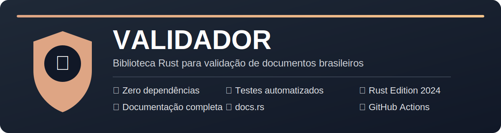

<p align="center">
    
</p>

<h1 align="center">Validador</h1>

<p align="center">
    Biblioteca Rust para validação de CPF utilizando o algoritmo oficial da Receita Federal.
</p>

<p align="center">
    
    
    
    
    
</p>

---

Uma biblioteca simples, rápida e sem dependências externas para validar números de **CPF (Cadastro de Pessoas Físicas)**.

Ideal para aplicações CLI, APIs REST, microsserviços, aplicações Web, estudos da linguagem Rust e projetos que necessitem validar CPFs de forma segura e eficiente.

---

# Índice

- [Características](#características)
- [Instalação](#instalação)
- [Uso](#uso)
- [API](#api)
- [Como funciona](#como-funciona)
- [Exemplo de saída](#exemplo-de-saída)
- [Executando os testes](#executando-os-testes)
- [Qualidade do código](#qualidade-do-código)
- [MSRV](#msrv)
- [Segurança](#segurança)
- [Estrutura do projeto](#estrutura-do-projeto)
- [Roadmap](#roadmap)
- [Contribuindo](#contribuindo)
- [Licença](#licença)

---

# Características

- ✅ Validação completa dos dígitos verificadores
- ✅ Aceita CPF com ou sem máscara
- ✅ Remove automaticamente caracteres não numéricos
- ✅ Rejeita CPFs contendo todos os dígitos iguais
- ✅ API simples
- ✅ Sem dependências externas
- ✅ Cobertura por testes
- ✅ Documentação no docs.rs
- ✅ Compatível com Rust Edition 2024

---

# Instalação

Adicione ao `Cargo.toml`:

```toml
[dependencies]
crate_validador_rust = "0.1.1"
```

ou diretamente pelo GitHub

```toml
[dependencies]
crate_validador_rust = { git = "https://github.com/josearodrigues/crate-validador-rust.git" }
```

---

# Uso

```rust
use crate_validador_rust::validar_cpf;

fn main() {

    let cpf = "529.982.247-25";

    if validar_cpf(cpf) {
        println!("CPF válido");
    } else {
        println!("CPF inválido");
    }

}
```

Também funciona sem formatação.

```rust
assert!(validar_cpf("52998224725"));
```

CPF inválido

```rust
assert!(!validar_cpf("12345678900"));
```

---

# API

A biblioteca atualmente disponibiliza:

```rust
pub fn validar_cpf(cpf: &str) -> bool
```

| Retorno | Significado |
|----------|-------------|
| `true` | CPF válido |
| `false` | CPF inválido |

---

# Como funciona

A validação segue o algoritmo oficial utilizado pela Receita Federal.

As etapas são:

1. Remove caracteres não numéricos;
2. Verifica se existem exatamente 11 dígitos;
3. Rejeita sequências de dígitos iguais;
4. Calcula o primeiro dígito verificador;
5. Calcula o segundo dígito verificador;
6. Compara os dígitos calculados com os informados.

---

# Exemplo de saída

```
CPF válido
```

ou

```
CPF inválido
```

---

# Executando os testes

```
cargo test
```

---

# Executando o exemplo

```
cargo run --example validar
```

---

# Qualidade do código

Antes de publicar uma nova versão execute:

```
cargo fmt

cargo clippy --all-targets --all-features

cargo test

cargo package

cargo publish --dry-run
```

---

# MSRV

A versão mínima do compilador Rust suportada (**MSRV**) será definida oficialmente quando o projeto atingir a versão **1.0.0**.

Até lá, recomenda-se utilizar a versão estável mais recente do Rust.

---

# Segurança

Esta biblioteca **apenas verifica se um CPF é matematicamente válido**.

Ela **não**:

- consulta a Receita Federal;
- verifica se o CPF existe;
- verifica situação cadastral;
- identifica CPFs cancelados;
- identifica CPFs pertencentes a pessoas falecidas.

Em outras palavras, um CPF pode ser matematicamente válido e ainda assim não existir na base oficial da Receita Federal.

---

# Estrutura do projeto

```
.
├── .github/
│   └── workflows/
│       └── rust.yml
│
├── assets/
│   └── banner.svg
│
├── examples/
│   └── validar.rs
│
├── src/
│   ├── cpf.rs
│   └── lib.rs
│
├── tests/
│   └── cpf.rs
│
├── .editorconfig
├── .gitignore
├── CHANGELOG.mds
├── CODE_OF_CONDUCT.md
├── CONTRIBUTING.md
├── Cargo.toml
├── LICENSE-APACHE
├── LICENSE-MIT
├── README.md
├── SECURITY.mda
└── SUPPORT.md
```

O projeto está organizado da seguinte forma:

| Caminho | Descrição |
|---------|-----------|
| `src/` | Código-fonte da biblioteca |
| `tests/` | Testes de integração |
| `examples/` | Exemplos de utilização |
| `assets/` | Recursos gráficos utilizados no README |
| `.github/workflows/` | Integração contínua (GitHub Actions) |
| `CHANGELOG.md` | Histórico das versões |
| `CONTRIBUTING.md` | Guia para contribuidores |
| `CODE_OF_CONDUCT.md` | Código de conduta da comunidade |
| `SECURITY.md` | Política de segurança |
| `SUPPORT.md` | Informações sobre suporte |
| `LICENSE-MIT` | Licença MIT |
| `LICENSE-APACHE` | Licença Apache 2.0 |
| `Cargo.toml` | Manifesto da crate |

---

# Roadmap

## Próximas funcionalidades

- [ ] CNPJ
- [ ] PIS/PASEP
- [ ] CNH
- [ ] Título de Eleitor
- [ ] Benchmark utilizando Criterion
- [ ] Suporte a `no_std`
- [ ] Cobertura de testes superior a 95%

---

# Contribuindo

Contribuições são muito bem-vindas.

Caso encontre algum problema ou tenha sugestões:

1. Abra uma Issue;
2. Faça um Fork;
3. Crie uma branch;
4. Envie um Pull Request.

---

# Licença

Este projeto está licenciado sob os termos das licenças **MIT** ou **Apache License 2.0**, à sua escolha.

Consulte os arquivos:

- `LICENSE-MIT`
- `LICENSE-APACHE`

---

# Autor

José Américo Rodrigues

GitHub:
https://github.com/josearodrigues

---

# Agradecimentos

Este projeto foi desenvolvido como parte dos estudos da linguagem Rust e tem como objetivo servir como uma biblioteca simples, idiomática e alinhada às recomendações da comunidade Rust.